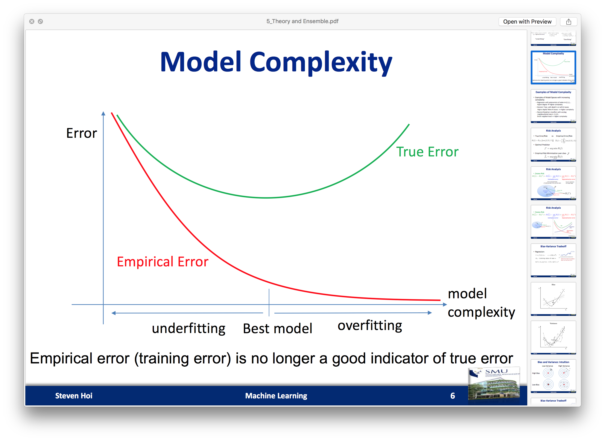

# Step 3 Relevance Classification
Using the labelled data from the research assistants, we are going to create a a relevance model to classify the tweets.
It will be a two class classification problem.
If a tweet is relevant, it will be 1, else 0.

## Methodology

We first investigate how the model will performed using a baseline method, Naive Bayes.

### Baseline

Experiment setup:

    - Naive Bayers classifier (with default values)
    - 10-fold cross validation
    - Stratified shuffle split (same number of each class per split)
    - 80% training data, 20% testing data
    - Treebank tokenzier

Result:

```
[*] Average Train Accuracy/Error: 	0.881	0.119
[*] Average Test Accuracy/Error: 	0.811	0.189
[*] Average F1: 			0.811
[*] Average MCC: 			0.623
```

Question:

We follow up with comparing if a sentiment-aware tokenizer will perform better than the widely accepted treebank-style tokenzier.

### Sentiment-aware tokenizers

Experiment setup:

    - Naive Bayers classifier (with default values)
    - 10-fold cross validation
    - Stratified shuffle split (same number of each class per split)
    - 80% training data, 20% testing data
    - [Sentiment-aware tokenzier](http://sentiment.christopherpotts.net/tokenizing.html)

Result:

```
[*] Average Train Accuracy/Error: 	0.843	0.157
[*] Average Test Accuracy/Error: 	0.784	0.216
[*] Average F1: 			0.784
[*] Average MCC: 			0.569
```

From our experiment, a treebank-style tokenizer performed better.
Therefore, we will use this tokenizer to formulate our final solutions.

Question:

There is a 0.05 to 0.07 gap between our training error and testing error. Could we reduce this gap by reducing overfitting in our model?
E.g. using mutal information to select top 100 features?

### Top 100 features using mutual information

Experiment setup:

    - Naive Bayers classifier (with default values)
    - 10-fold cross validation
    - Stratified shuffle split (same number of each class per split)
    - 80% training data, 20% testing data
    - Treebank tokenzier
    - Top 100 features using mutual information

Result:

```
[*] Average Train Accuracy/Error: 	0.769	0.231
[*] Average Test Accuracy/Error: 	0.756	0.244
[*] Average F1: 			0.755
[*] Average MCC: 			0.519
```

Using top 100 features selected via mutual information, we are able to reduce the gap of the train-test error to 0.1.
But this trade-off reduce our Accuracy, F1 and MCC by 0.03 to 0.05.
To reduce over-fitting and reduce our feature size, we decide to take this approach.

Question:

If we include LIWC features, will our classifiers perform better?

### Using output from LIWC as features

Experiment setup:

    - Naive Bayers classifier (with default values)
    - 10-fold cross validation
    - Stratified shuffle split (same number of each class per split)
    - 80% training data, 20% testing data
    - Treebank tokenzier
    - Top 100 features using mutual information
    - Additional LIWC features (Analytic, Clout, Authentic, Tone, affect, posemo, negemo)

Result:

```
[*] Average Train Accuracy/Error: 	0.619	0.381
[*] Average Test Accuracy/Error: 	0.630	0.370
[*] Average F1: 			0.630
[*] Average MCC: 			0.260
```

Using LIWc features actually decrease all the score of the mdoel. 
This implies that the LIWC features does not help in our relevance model.

Question:

Using the previous setup, how does a more complicated model perform?
e.g. Random forest classifier?

### Random forest classifier

Experiment setup:

    - Random forest classifier (with default values)
    - 10-fold cross validation
    - Stratified shuffle split (same number of each class per split)
    - 80% training data, 20% testing data
    - Treebank tokenzier
    - Top 100 features using mutual information

Result:

```
[*] Average Train Accuracy/Error: 	0.983	0.017
[*] Average Test Accuracy/Error: 	0.784	0.216
[*] Average F1: 			0.782
[*] Average MCC: 			0.577
```

Basic random forest classifer actually performed better.
Something to note is that the gap between train and test error seems to increase. 
The empricial error decrease (and thus moving towards overfitting) as the model complexity increase, while true error decrease only slightly.
This trends points to a better model as compared to naive bayes.



Question:

What if we increase the number of estimated for the random forest classifiers?

### Random forest classifier with more estimator

Experiment setup:

    - Random forest classifier (n_estimator=500)
    - 10-fold cross validation
    - Stratified shuffle split (same number of each class per split)
    - 80% training data, 20% testing data
    - Treebank tokenzier
    - Top 100 features using mutual information

Result:

```
[*] Average Train Accuracy/Error: 	0.997	0.003
[*] Average Test Accuracy/Error: 	0.810	0.190
[*] Average F1: 			0.808
[*] Average MCC: 			0.629
```

Question:

Will adding LIWC features move the F1 and MCC up slightly?

### Random forest classifier with more estimator and LIWC features

Experiment setup:

    - Random forest classifier (n_estimator=500)
    - 10-fold cross validation
    - Stratified shuffle split (same number of each class per split)
    - 80% training data, 20% testing data
    - Treebank tokenzier
    - Top 100 features using mutual information
    - Additional LIWC features (Analytic, Clout, Authentic, Tone, affect, posemo, negemo)

Result:

```
[*] Average Train Accuracy/Error: 	0.998	0.002
[*] Average Test Accuracy/Error: 	0.810	0.189
[*] Average F1: 			0.809
[*] Average MCC: 			0.630
```

With LIWC features, it performed a 0.001 better when without. 